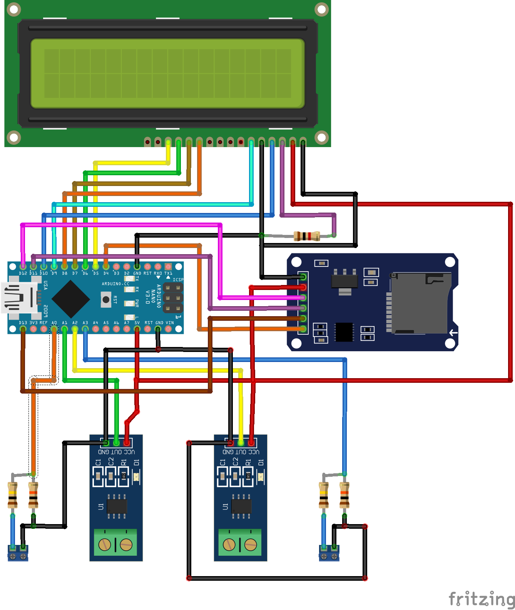

# Battymeter

This proyect is about a device that measures two continues voltages and two continues currents. The values are shown in a lcd desplay and via serial. It's also stored in a microSD card in csv format.

		

